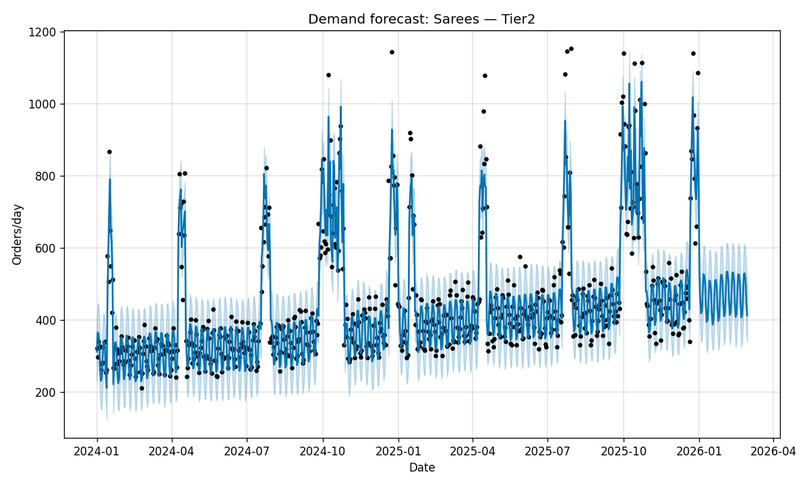
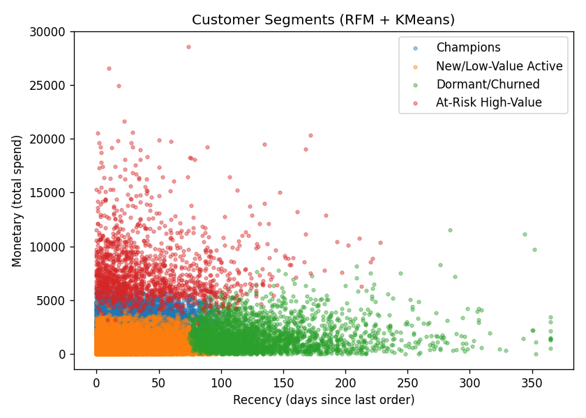

# Tier 2/3 Demand Forecasting & Customer Segmentation

**Problem:** Meesho's growth story is built on Tier 2/3 India, and demand
there is heavily festival-driven (Diwali, Raksha Bandhan, Republic Day sale,
Eid) rather than smoothly seasonal like Western e-commerce. Two linked
business questions:
1. **How much inventory/seller-capacity should we pre-position per
   city-tier x category ahead of each festive window?**
2. **Which customers should retention marketing prioritize** — a first-time
   Tier3 buyer behaves nothing like a repeat Tier1 buyer, so segment-specific
   campaigns beat blanket push notifications.

## Why this is relevant to Meesho specifically
- Meesho's growth narrative explicitly leans on Bharat/Tier2-3 penetration —
  a project that treats "average daily demand" as one number misses the point.
- Demand forecasting failures show up as real cost: stockouts during a
  festive spike = lost GMV; over-forecasting = locked-up working capital in
  regional warehouses.

## Data
`data/generate_data.py` builds:
- `daily_sales.csv`: 2 years x 3 city tiers x 8 categories of daily order
  counts, with weekly seasonality, a Tier2/3-skewed growth trend, and
  explicit festive-window multipliers.
- `customers.csv`: 20k synthetic customers with Recency/Frequency/Monetary
  fields, with realistic Tier1 vs Tier2/3 spend/frequency differences baked in.

## Approach
- **Forecasting:** Facebook Prophet with festive windows encoded as custom
  holidays (with `lower_window`/`upper_window` to capture multi-day sale
  periods, not single-day spikes) + weekly/yearly seasonality.
- **Segmentation:** RFM features → StandardScaler → KMeans (k=4, chosen via
  elbow method), then labeled into business-readable segments (Champions,
  At-Risk High-Value, New/Low-Value Active, Dormant/Churned).
- **Dashboard:** Streamlit app with tabs for both, so you can show a live demo
  in an interview instead of static plots.

## Run it
```bash
pip install -r requirements.txt
python data/generate_data.py                                  # data already included
python forecast.py --city_tier Tier2 --category Sarees --horizon 60
python segmentation.py
streamlit run app.py
```

## Sample output



## What I'd do with more time / real data
- Hierarchical/pooled forecasting across categories (categories share some
  seasonal signal — a full hierarchical Prophet or a global model like
  LightGBM with tier/category as features would likely beat per-series Prophet)
- Tie segment labels to an actual intervention (e.g. differentiated discount
  depth or reminder cadence per segment) and simulate expected GMV lift
- Replace fixed festive-window dates with an actual lunar-calendar library,
  since Diwali/Eid shift every year
